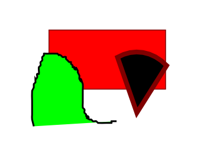

libcairo Julia API
==================

cairo interface
---------------

This is simply binding for cairo calls. The concepts of Surfaces, Context, Paths and Drawing operators visible in the original cairo still apply [cairo API reference manual](http://www.cairographics.org/manual/).

### Cairo Surface 

+ CairoImageSurface
+ CairoPDFSurface


Julia extension
---------------

For the use in various Julia packages, some additional functions which are not part of the libcairo itself are added as convenience functions.

+ layour
+ layout

Image test
----------

There should be an image right here.



SCC test
--------

We learned recently, that code cannot be inlined.

```julia


arc(cr, 128.0, 128.0, 76.8, 0, 2 * pi);
clip(cr);

new_path(cr); # current path is not consumed by cairo_clip()
rectangle(cr, 0, 0, 256, 256);
fill(cr);
set_source_rgb(cr, 0, 1, 0);
move_to(cr, 0, 0);
line_to(cr, 256, 256);
move_to(cr, 256, 0);
line_to(cr, 0, 256);
set_line_width(cr, 10.0);
stroke(cr);

```

Other text.


