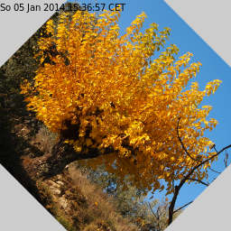
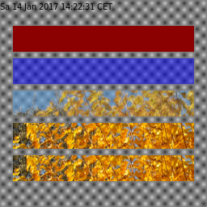
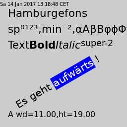

## Sample programs #

This is roughly a copy of the sample code listed at [cairographics.org/samples](http://www.cairographics.org/samples/).
These examples are C code and assume that you've already set up a Cairo surface and Cairo Context.

This (samples) directory contains ports of these examples to julia, additionally creating the Surface and Context, adding a time-stamp to the image, and saving the result to a .png file.

### arc #

Example of using the arc path operator [sample_arc.jl](sample_arc.jl).
Note: The path creation starts without current point, otherwise there would be a linesegment first, before starting of the arc.

### arc_negative #

Example of using the arc_negative path operator [sample_arc_negative.jl](sample_arc_negative.jl).

### clip #

A clip path, a circle is defined, then the drawing is done [sample_clip.jl](sample_clip.jl).

### clip image #

Like the previous, but now inserting a picture by reading a .png to an Image Surface. Note: the function is called read_from_png and creates an Image Surface; while in pure C cairo this would be a call of cairo_image_surface_create_from_png [sample_clip_image.jl](sample_clip_image.jl).

### curve rectangle #

Example of more complex path construction, here a rectangle constructed be four bezier segments. Note: Different as in the original example, this here now puts the path construction and stroke and fill operations into a function with coordinates and corner radius as arguments [sample_curve_rectangle.jl](sample_curve_rectangle.jl).

### curve to #

Example of using the curve to path operator, which adds a cubic Bézier spline to the current path [sample_curve_to.jl](sample_curve_to.jl).

### dash #

Example of using a dash line pattern for stroking a path. Note: the julia set_dash uses the length of the dash array to set the ndash internally [sample_dash.jl](sample_dash.jl).

### fill and stroke 2 #

Example of creating a path of non connected areas and fill - while preserving the path - and stroke [sample_fill_and_stroke2.jl](sample_fill_and_stroke2.jl).

### fill style #

Exmaple of using the different fill rules. The same path is filled and stroked [sample_fill_style.jl](sample_fill_style.jl). Note: the julia function is called set_fill_type while the pure C cairo is called with set_fill_rule.

### gradient #

Example of gradients - both linear and radiant - as definition and used for filling [sample_gradient.jl](sample_gradient.jl).

### image #

Example of painting with a Image Surface as source [sample_image.jl](sample_image.jl).

### image pattern #

Example of painting with a Image Surface as pattern [sample_imagepattern.jl] (sample_imagepattern.jl).

### multi segment caps #

Example of stroking a path with non connected segments [sample_multi_segment_caps.jl](sample_multi_segment_caps.jl).

### rounded rectangle #

Example of more path operators, custom shape could be wrapped in a function [sample_rounded_rectangle.jl](sample_rounded_rectangle.jl).

### set line caps

Examples of the line cap settings [sample_set_line_cap.jl](sample_set_line_cap.jl).

### set line join

Examples of the line join settings [sample_set_line_join.jl](sample_set_line_join.jl).

### text

Example of setting text, one with text_show, second with text_path extending the current path and fill and stroke the outline [sample_text.jl](sample_text.jl).

### text align center

Example of getting the text extents, then centering the text around 128.0,128.0 [sample_text_align_center.jl](sample_text_align_center.jl).

### text extents

Example of getting the text extents, plotting the dimension [sample_text_extents.jl](sample_text_extents.jl).

### copy path

Example of getting the path to a single character via text_path, copy_path and convert to an Array of CairoPathEntry [sample_copy_path.jl](sample_copy_path.jl). 

### image (from stream)

Example of painting with a Image Surface as source that was created by reading from a stream. The example reads the png data from an inline string [sample_imagestream.jl](sample_imagestream.jl).

## More Samples for Testing

The following examples have been created to have more coverage in testing (all samples_X are executed).

### alpha paint

Example to use set_source with different input (for multiple dispatch). For better viewing the background is not plain gray anymore, but has structure
[sample_alpha_paint.jl](sample_alpha_paint.jl).

### image copy

Example to use copy(Image). You need to take care about coordinate transformation, as the copy is inplace [sample_image_copy.jl](sample_image_copy.jl).

### operators

Example to use the defined operators for set_operator with two filled rectangles [sample_operators.jl](sample_operators.jl).

### set dash

Example to use the set line type function (input to set_dash) [sample_set_dash.jl](sample_set_dash.jl).

### copy path flat

[sample_copy_path_flat.jl](sample_copy_path_flat.jl). 

### pango text

Example of a few (but not all) pango text formating options [sample_pango_text.jl](sample_pango_text.jl).

### mesh pattern

Example of creating and using a mesh pattern [sample_meshpattern.jl](sample_meshpattern.jl). 
Mesh patterns are tensor-product patch meshes (type 7 shadings in PDF), read more in [http://www.cairographics.org/manual/cairo-cairo-pattern-t.html#cairo-pattern-create-mesh] or [http://www.w3.org/TR/SVG2/pservers.html#MeshGradients].

## Recording and Scripting Surfaces

Example of using Recording surface, simple copy, then scaled and offset.

Example of writing to script, put script text into frame.

