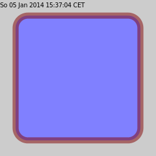

Sample programs.
################

This is mainly a copy of the sample code examples listed at [cairographics.org/samples](http://www.cairographics.org/samples/).
The examples are C code and need a environment of a Cairo surface and Cairo Context.

This (samples) directory contains independend julia programms that prefixes the orginal, ported code with the creation of a Surface and Context and an output routine to a .png file, rendering the current time into picture.

### arc #

Example of using the arc path operator [sample_arc.jl](sample_arc.jl).
Note: The path creation starts without current point, otherwise there would be a linesegment first, before starting of the arc.

### arc_negative #

Example of using the arc_negative path operator [sample_arc_negative.jl](sample_arc_negative.jl).

### clip #

A clip path, a circle is defined, then the drawing is done [sample_clip.jl](sample_clip.jl).

### clip image #

Like the previous, but now inserting a picture by reading a .png to an Image Surface. Note: the function is called read_from_png and creates an Image Surface; while in pure C cairo this would be a call of cairo_image_surface_create_from_png [sample_clip_image.jl](sample_clip_image.jl).

### curve rectangle #
missing.

### curve to #

Example of using the curve to path operator, which adds a cubic Bézier spline to the current path [sample_curve_to.jl](sample_curve_to.jl).

### dash #

Example of using a dash line pattern for stroking a path. Note: the julia set_dash uses the length of the dash array to set the ndash internally [sample_dash.jl](sample_dash.jl).

### fill and stroke 2 #

Example of creating a path of non connected areas and fill - while preserving the path - and stroke [sample_fill_and_stroke2.jl](sample_fill_and_stroke2.jl).

### fill style #

Exmaple of using the different fill rules. The same path is filled and stroked [sample_fill_style.jl](sample_fill_style.jl). Note: the julia function is called set_fill_type while the pure C cairo is called with set_fill_rule.

### gradient #
missing.

### image #

Example of painting with a Image Surface as source [sample_image.jl](sample_image.jl).

### image pattern #

Example of painting with a Image Surface as pattern [sample_imagepattern.jl _image.jl).

### multi segment caps #
missing.

### rounded rectangle #

Example of more path operators, custom shape could be wrapped in a function [sample_rounded_rectangle.jl](sample_rounded_rectangle.jl).

### 

